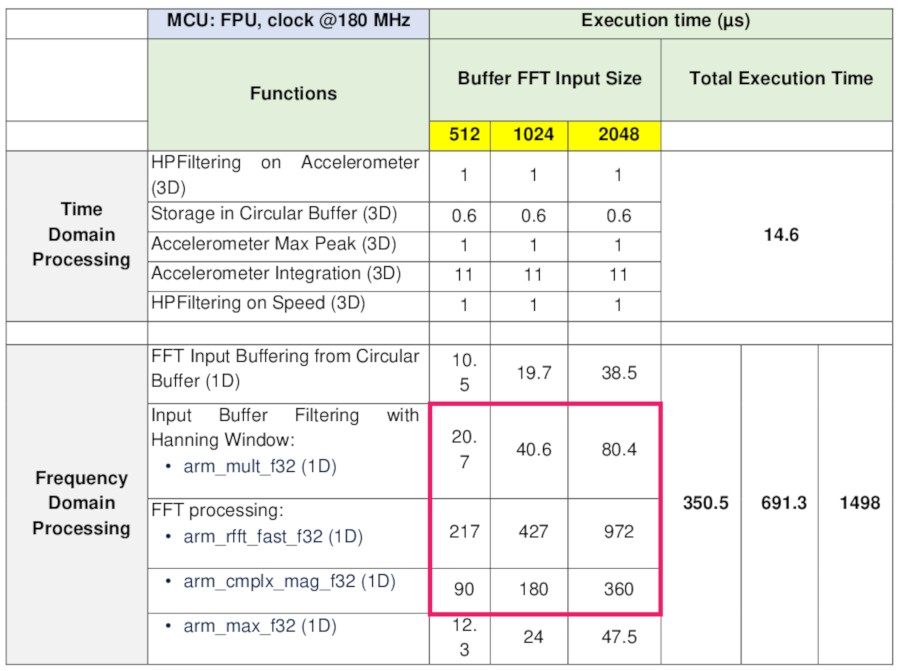
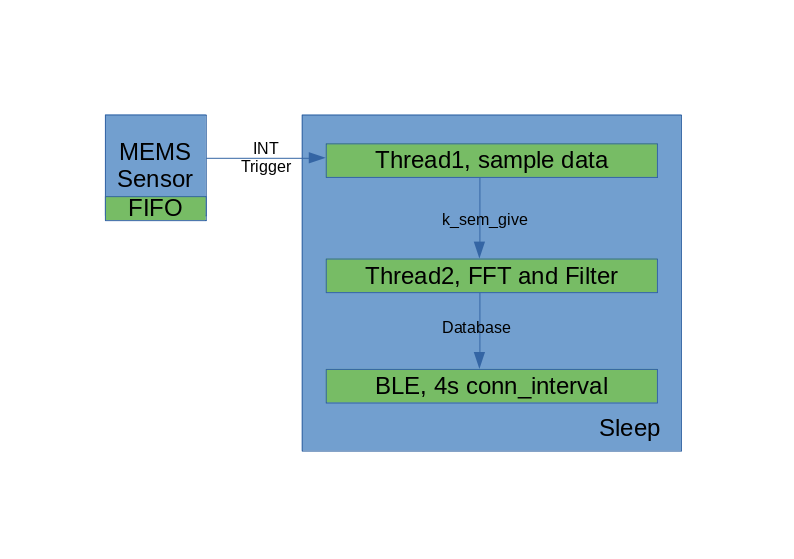
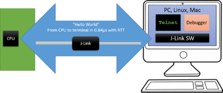

# Issues

## Performance
A smart node based on a capacitive MEMS accelerometer and a suitable MCU can integrate advanced
time and frequency domain processing: the capacitive MEMS accelerometer provides digital data to the
microcontroller, which performs filtering, windowing, and FFT averaging of acceleration and speed
frequency spectra.

We migrate the application from STM32F469AI(@180mHz) to nRF52832(64mHz), so the performance concern is reasonable.



The most time consuming process is the FFT and Filter, which is almost 90 percent of the algorithm timeslot. 

Thanks to the ARM® Cortex®-M4 32-bit microcontroller with FPU and loaded CMSIS DSP_Lib, all the FFT and Filter will running on the hardware FPU(Float Point Unit), which is not very depend on the core speed.


As a result, FFT and Filter performance is not a critical issue for the poring mission. We will address the issue by testing on the hardware after porting.


## Flash and RAM
STM32F469AI has up to 2 Mbytes flash memory , up to 384 Kbytes of SRAM. By contract, nRF52832 has Flash 512 KB (+ cache) + 64 KB RAM. Is it enough for our application?

Although, our device is a simple IoT device, it still need to deal with tough FFT and Filter computing. In such case, RAM size is mattered. Below is a table about resource requirement in nRF52832 when running different points FFT algorithm, tested under GCC ARM Embedded Toolchain 8-2018-q4-major.

|    FFT     | Flash | RAM | Usage | 
| ---------- | ----- | --- | ----- |
|  512 pints |  26.7 KB | 20.6 KB |   32% |
| 1024 pints |  26.7 KB | 23.6 KB |   36% |
| 2048 pints |  26.7 KB | 29.6 KB | 49.6% |

For the Flash size requirement, we will discuss later in the OTA update. Also, we will address the issue by testing on the hardware after porting.

### OTA update

## Power consumption
The IoT devices are mostly supposed to be autonomous for years, especially for industry use case. It's better up to 10 years in our case.

To archive this goal, we will enable sensor trigger mode and a 10 bit, 32-level FIFO inside the MEMS accelerometer sensor, which means the main chip will sleep until sensor have enough data. The data acquire time slot is 32ms under 1Khz sample rate.

Beyond that the main chip will process data with FFT and Filter algorithm about every second to finger out current motor vibration frequency.

Also we can set a longer Bluetooth Low Energy connection interval, like 4 seconds, in final product.


By roughly calculating, it looks fine to archive 10 years use. We will address this issue by testing on the hardware after porting.


## Algorithm fine tuning
It's not very convenience to fine tuning algorithm on the target board, we need to grap data from the sensor and progress on PC.

Although, we can simulate data in the very beginning even if the hardware is not ready. Eventrally, we need to put out device to real working conditions, and get those data.

But serial port(UART) bandwidth is not enough. we need maximum 5kHz * 10bit * 3 = 150kbps.

SEGGER's Real Time Transfer (RTT) is the new technology for interactive user I/O in embedded applications. It combines the advantages of SWO and semihosting at very high performance. 

The maximum speed at which output data can be sent to the host depends on the target buffer size and target interface speed. Even with a small target buffer of 512 Bytes an RTT speed of up to 1 MByte/sec is possible with a high interface speed and 0.5 MByte/sec are possible with a regular J-Link model.



### How to enable Segger’s J-Link supports Real-Time Tracing (RTT) 
```
CONFIG_HAS_SEGGER_RTT=y
CONFIG_USE_SEGGER_RTT=y
CONFIG_RTT_CONSOLE=y
CONFIG_UART_CONSOLE=n
```
GNU/Linux and macOS (OS X)
Open JLinkRTTLogger from a terminal
- Select the following options:
- Device Name: Use the fully qualified device name for your IC
- Target Interface: SWD
- Interface Speed: 4000 KHz
- RTT Control Block address: auto-detection
- RTT Channel name or index: 0
- Output file: filename or /dev/stdout to display on the terminal directly


