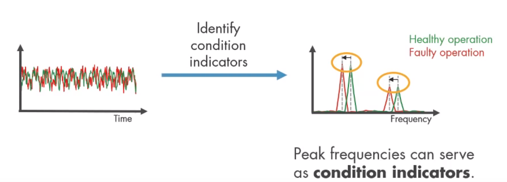
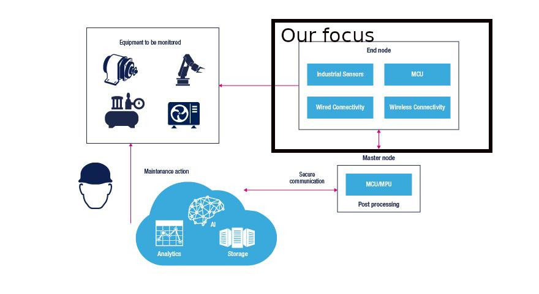
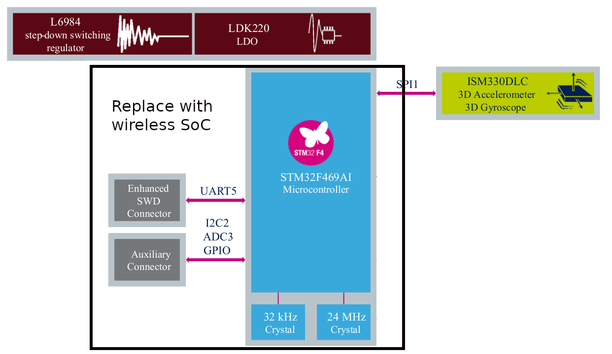

# Motors Predictive Maintenance device

## Introduction
### What is Motors Predictive Maintenance device?
Firstly, Predictive maintenance (PdM) techniques are designed to help determine the condition of in-service equipment in order to estimate when maintenance should be performed.

Motors Predictive Maintenance device is a sensor node with algorithms for time and **frequency domain** signal processing and analysis of 3D digital accelerometers for motors predictive maintenance applications

Basically, it monitors the condition of motors using **vibration data**. Damage to the motors results in changes to the frequency and magnitude of the vibrations. The **peak frequency** and peak magnitude are thus useful condition indicators, providing information about the kind of vibrations present in the motors.

Fig. 1

### System architecture 
It's mainly four parts:
- Actors
- **End nodes**
- Master node(gateway)
- Cloud

A typical industry IoT application to ensure the system doesn’t fail. Vendors would also want to know that their appliances/machines are installed and used properly, for the purpose of warranty or service warning.

Here we are focusing on the "End node".

Fig. 2

### The starting point
We take ST STEVAL-BFA001V1B as a reference which is an industrial reference design kit designed for condition monitoring (CM) and predictive maintenance (PdM).

https://www.st.com/content/st_com/en/products/evaluation-tools/solution-evaluation-tools/communication-and-connectivity-solution-eval-boards/steval-bfa001v1b.html#overview

### Targe
Monitoring the machine and run for multiple years on a battery, also connect to the Cloud for remote decision/action.

Here, we will port the "End node" which is based on STM32 chipset initially to a new low power multiprotocol SoC(nRF52832). Debugging and testing.

Fig. 3
