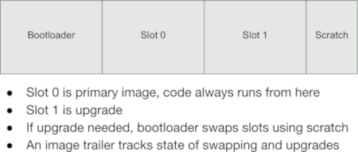

# Potential issues
We migrate the application from STM32F469AI to nRF52832, a new low-power wireless chipset, few things can be the issues

- #1 Performance
- #2 Flash and RAM size
- #3 Power consumption
- #4 Algorithm fine tuning
- #5 Production(mostly wireless part) 

## Performance concern
A smart node based on a capacitive MEMS accelerometer and a suitable MCU can integrate advanced
time and frequency domain processing: the capacitive MEMS accelerometer provides digital data to the
microcontroller, which performs filtering, windowing, and FFT averaging of acceleration and speed frequency spectra.

We migrate the application from STM32F469AI(@180mHz) to nRF52832(@64mHz), so the performance concern is reasonable.

According to ST demo documentation the most time consuming process is the FFT and Filter, which is almost 90 percent of all of the algorithms. 

Table. 1

Thanks to the ARM® Cortex®-M4 32-bit microcontroller with FPU and loaded CMSIS DSP_Lib, all the FFT and Filter will running on the hardware FPU(Float Point Unit), which is not very depend on the core speed.

As a result, FFT and Filter performance is not a critical issue for the porting mission. We will address the issue by testing on the hardware after porting.

## Flash and RAM size concern
STM32F469AI has up to 2 Mbytes flash memory , up to 384 Kbytes of SRAM. By contract, nRF52832 has 512 KB Flash + 64 KB RAM. Is it enough for our application?

Although, our device is a simple IoT device, it still need to deal with tough FFT and Filter computing. In such case, RAM size is mattered. Below is a table about resource requirement in nRF52832 when running different FFT algorithms, tested under GCC ARM Embedded Toolchain 8-2018-q4-major.

|    FFT     | Flash | RAM | RAM Usage | 
| ---------- | ----- | --- | ----- |
|  512 pints |  26.7 KB | 20.6 KB |   32% |
| 1024 pints |  26.7 KB | 23.6 KB |   36% |
| 2048 pints |  26.7 KB | 29.6 KB | 49.6% |

Table. 2

For the Flash size requirement, we will discuss later in the OTA update. Also, we will address the issue by testing on the hardware after porting.

**OTA update & Application**
An OTA(over-the-air) update is the wireless delivery of new software or data to mobile devices. It is a essential feature for IoT devices, but also is the most flash consuming feature. 

We need at least 32KB for bootloader, which is used to handle in-system update procedures. We also need a primary slot for application and another same size slot for upgrade. also few KBs for other status or user date. Take below picture as a reference.

Table. 1

nRF52832-QFAC have 512 KB flash, so we need to keep our application slim and fit into 200 KB. Looks it's not a big issue.

## Power consumption
The IoT devices are mostly supposed to be autonomous for years, especially for industry use case. It's better up to ten years in our case.

To archive this goal, we will enable sensor trigger(interrupt) mode and a 10 bit, 32-level FIFO inside the MEMS accelerometer sensor, which means the main chip will sleep until sensor have 32 samples, then wake up to read back those data at once. The data acquire time slot is 32ms under 1Khz sample rate.

Beyond that the main chip will process data with FFT and Filter algorithm about every second to finger out current motor vibration frequency.

Also we can set a longer Bluetooth Low Energy connection interval, like 4 seconds, in final product.

Fig. 5

By roughly calculating, it looks fine to archive 10 years usage. We will address this issue by testing on the hardware after porting.

## Algorithm fine tuning
It's not very convenience to fine tuning algorithm on the device, we need to grab data from the sensor and progress on PC.

Although, we can simulate data in the very beginning even if the hardware is not ready. Eventually, we need to put out device to real working conditions, and get those data. But serial port(UART) or BLE bandwidth is not enough. 
    
maximum data rate: 

    5 kHz(max sample rate) * 10 bit(data length per unit) * 3(3D axis) = 150 kbps.

SEGGER's Real Time Transfer (RTT) is the new technology for interactive user I/O in embedded applications. It combines the advantages of SWO and semihosting at very high performance. 

The maximum speed at which output data can be sent to the host depends on the target buffer size and target interface speed. Even with a small target buffer of 512 Bytes an RTT speed of up to **1 MByte/sec** is possible with a high interface speed and **0.5 MByte/sec** are possible with a regular J-Link model, which is much more then our maximum data rate requirement 150 kbps.

Fig. 6

### How to use Segger’s J-Link supports Real-Time Tracing (RTT) 
GNU/Linux and macOS (OS X)
Open JLinkRTTLogger from a terminal
- Select the following options:
- Device Name: Use the fully qualified device name for your IC
- Target Interface: SWD
- Interface Speed: 4000 KHz
- RTT Control Block address: auto-detection
- RTT Channel name or index: 0
- Output file: filename or /dev/stdout to display on the terminal directly

