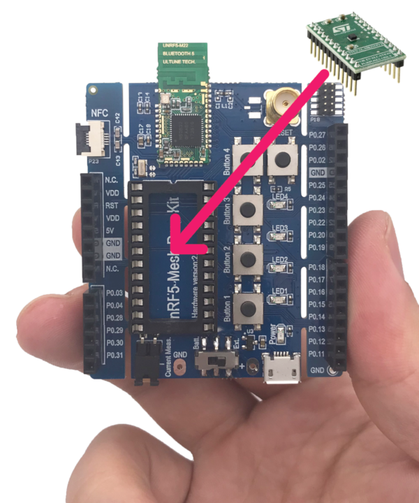

# Porting process
This section contains details regarding porting the OS/Software from the existing hardware to one with a new low-power chipset. Those porting process list here:
- Architecture porting
- Board Porting
- Application porting
    - seed project
    - adding sensor
    - adding Bluetooth Low Energy
    - adding algorithms (to be continue)
- Algorithm fine tuning (addressing #5 issue)

## First, RTOS or not?
Yes, we need a RTOS. There are many reasons, the most important one is that it will help you to migrate to different board ,chipset, architecture quickly. So, why not?

There are lots of choice of RTOS, like FreeRTOS, Threadx, Zephyr and so on. We use Zephyr here, which is a LFC Project, is a small, scalable RTOS for connected, resource constrained devices.

## Architecture porting
can be divided in several parts:
- The early boot sequence:  
    each architecture has different steps it must take when the CPU comes out of reset  
- Interrupt and exception handling:  
    each architecture handles asynchronous and unrequested events in a specific manner  
- Thread context switching:  
    the Zephyr context switch is dependent on the ABI and each ISA has a different set of registers to save  
- Thread creation and termination:  
    A thread’s initial stack frame is ABI and architecture-dependent, and thread abortion possibly as well  
- Device drivers:  
    most often, the system clock timer and the interrupt controller are tied to the architecture  
    (some required, some optional).
- Utility libraries:  
    some common kernel APIs rely on a architecture-specific implementation for performance reasons  
- CPU idling/power management:  
    most architectures implement instructions for putting the CPU to sleep  
    (partly optional, most likely very desired).
- Fault management:  
    for implementing architecture-specific debug help and handling of fatal error in threads  
    (partly optional).
- Linker scripts and toolchains:  
    architecture-specific details will most likely be needed in the build system and when linking the image  

Fortunately, we already have the same architecture(ARM) and same chipset(nRF52832) even similar board(nrf52_pca10040) in Zephyr project RTOS, so we only need to port on the board level.

## Board Porting

Our target board is a customized nRF52832 board, with Arduino UNO hardware interface and proprietary DIP-24 hardware interface.

Connecting a 3-axis MEMS accelerometer daughterboard, STEVAL-MKI151V1
with LIS2DH12 on it, to the main board. Later we can replace this sensor to an industry level accelerometer ISM330DLC.



```
# Enter working folder
cd $(WORKING_FOLDER) 

# copy nrf52_pca10040 board and modify
cp -r $(ZEPHYR_DIR)/boards/arm/nrf52_pca10040/ ./
mv boards/arm/nrf52_pca10040/ boards/arm/nrf5_meshdk/
# TODO: sed | 
...
```
You also can find the example code in https://github.com/overheat/mPdM


## Application porting
### seed project
```
# Enter working folder
cd $(WORKING_FOLDER) 
# copy hello_world sample as seed
cp -r $(ZEPHYR_DIR)/samples/hello_world/* ./

# verify project
mkdir build && cd build
# Use cmake to configure a Ninja-based build system:# build system
cmake -GNinja -DBOARD=nrf5_meshdk -DBOARD_ROOT=$(WORKING_FOLDER)/ ..
# Now run ninja on the generated build system:
ninja
# Flash if everything goes well
ninja flash
```


You will see this:
```
***** Booting Zephyr OS zephyr-v1.14.0-1525-g591b0e1c7af2 *****
Hello World! nrf5_meshdk
```

### adding sensor
First, adding sensor Device tree description, it is a way of describing hardware and configuration information for boards.

Device tree was adopted for use in the **Linux kernel** for the PowerPC architecture. However, it is now in use for ARM and other architectures.
```
diff --git a/nrf5_meshdk.overlay b/nrf5_meshdk.overlay
new file mode 100644
index 0000000..b9c602f
--- /dev/null
+++ b/nrf5_meshdk.overlay
@@ -0,0 +1,16 @@
+&spi2 {
+
+       lis2dh@0 {
+               compatible = "st,lis2dh";
+               reg = <0>;
+               spi-max-frequency = <8000000>;
+               label = "LIS2DH";
+               int1-gpios = <&gpio0 13 0>;
+       };
+};
```

Adding project configuration.
```
diff --git a/prj.conf b/prj.conf
index b2a4ba5..8ce791b 100644
--- a/prj.conf
+++ b/prj.conf
@@ -1 +1,5 @@
-# nothing here
+CONFIG_SPI=y
+CONFIG_SENSOR=y
+CONFIG_LIS2DH=y
```

Finally, adding application code.
```
diff --git a/src/main.c b/src/main.c
index 2d4a7f0..6447431 100644
--- a/src/main.c
+++ b/src/main.c
@@ -5,9 +5,58 @@
 void main(void)
 {
-       printk("Hello World! %s\n", CONFIG_BOARD);
+       struct device *dev= device_get_binding(
+                               DT_INST_0_ST_LIS2DH_LABEL);
+
+       while(1){
+
+               printf("Accelerometer data:\n");
+               if (read_sensor(dev, SENSOR_CHAN_ACCEL_XYZ) < 0) {
+                       printf("Failed to read accelerometer data\n");
+               }
+               k_sleep(SLEEP_TIME);
+       }
 }
```

### adding Bluetooth Low Energy

### adding algorithms

## Algorithm fine tuning

Once enable Segger’s J-Link supports Real-Time Tracing (RTT), there will be a log file under project folder on your PC. It contains all the date send out by RTT channel. We can load those data to other software, like **Matlab**, for advanced algorithm fine tuning.

After algorithm fine tuning on PC, we need to port back those algorithm back to embedded device. For example, MATLAB Coder™ is an add-on product that allows you to generate portable and readable C or C++ code from your MATLAB code. This code can then be integrated directly into C/C++ development environment.


<center>Fig. 1</center>
