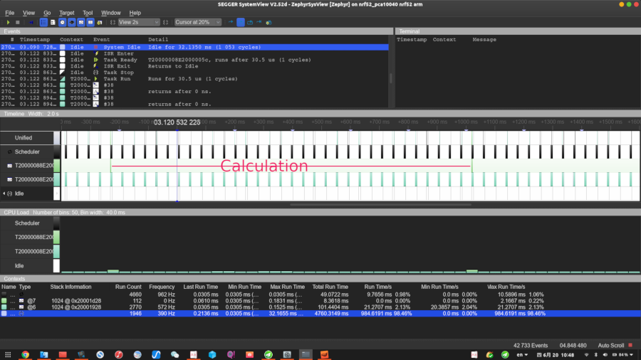

# Testing
After finishing a prototype, it is time to do some testing to make sure that the prototype behaves as expected.
There are few testing for addressing issues we mentioned before.

- Performance                       (addressing **#1** issue)
- Functions                         (addressing **#2** issue)
- power consumption                 (addressing **#3** issue)
- Production test                   (addressing **#5** issue)
- Other necessary testing or certification

<div STYLE="page-break-after: always;"></div>

## Performance overview
Here we utilize SEEGER's SystemView tools to monitor the overall performance behave.

**Enable SEEGER's SystemView tools in Zephyr**  
To enable this feature, adding this configuration to the project config file, `prj.conf`.
```
CONFIG_SEGGER_SYSTEMVIEW=y
```

SEGGER SystemView is a real-time recording and visualization tool for embedded systems that reveals the true runtime behavior of an application, going far deeper than the system insights provided by debuggers. Let's check the SEGGER SystemView window below:



<center>Fig. 10</center>

We can see the main chip wake up to read back those data at once every 32 ms(Thread1), Then process data with FFT and Filter algorithm about every second(Thread2). The device can finish those task inside one second time slot, which is means the performance is good enough.

BTW, we also can utilize **GDB**(CLI) or SEGGER **Ozone**(GUI) tools like a Performance Analyzer to go deeper into the application or algorithm.

For more information, please check [here](https://www.segger.com/products/development-tools/systemview/).

<div STYLE="page-break-after: always;"></div>

## Functions testing with a computer
**Application testing**
The following procedure for application testing.
- Download and install [nRF Connect for Desktop](https://www.nordicsemi.com/Software-and-Tools/Development-Tools/nRF-Connect-for-desktop).
- Connect the dongle or the second DK to a USB port of your computer.
- Power up the our device.
- Open nRF Connect for Desktop and add the Bluetooth® Low Energy app.
- Launch the Bluetooth Low Energy app.
- Click "Start scan".
- Find the device and click Connect.
- The default device name for the ble_app_uart example is "DUT".
- In nRF Connect, the FFT Frequency characteristic value changes to the vibration frequency in Hz.
- OTA update testing


<center>Fig. 11</center>

<div STYLE="page-break-after: always;"></div>

## power consumption
There are several ways to measure current. Using a dedicated power analyzer is the preferred way, but since most of us do not have access to a power analyzer, using an oscilloscope or an ampere meter an acceptable way. An ampere meter will only give us the average current and further investigation of the different components of the current draw is not possible. An oscilloscope on the other hand will give us the opportunity to measure both average current over a given time interval as well as capture the current profile of BLE events.

Here we will use a compromised solution, Nordic Semi's Power Profiler Kit (PPK), it is an affordable, flexible tool that measures the real-time power consumption of your designs. It measures current from 1 μA up to 70 mA and gives a detailed picture of the current profile for the user application. So it's much better than ampere meter or oscilloscope, and much cheaper than using a dedicated power analyzer.


<center>Fig. 12</center>

TODO: calculate.
For more information, please check [here](https://www.nordicsemi.com/?sc_itemid=%7B3CF36A90-6BA3-4EFC-954C-D9C1AAFD638F%7D).


<div STYLE="page-break-after: always;"></div>

## Production test
Finally, we are here! The primary function of a production test is to verify that all the components are mounted correctly and have correct values after assembling a device.

To perform a production test on a Bluetooth® low energy application, it is preferable to use a built-in
function called Direct Test Mode (DTM). The DTM enables testing of the RF parameters and is also used for
end-product qualification testing of the RF physical layer (RF PHY). All Bluetooth low energy products
include a UART interface that gives access to the Direct Test Mode (DTM).


<center>Fig. 13</center>

The DUT is controlled by sending DTM commands over the UART interface. There are ready made BLE full-tests and quick-tests available from Anritsu, along with the possibility to create manual test scripts.

The computer (Upper Tester) software is written in the **Python** programming language and consists of a DTM library. The DTM library can set up different DTM modes through UART commands as described in the Bluetooth specifications Ver 4.0, Vol 6, part F.

LitePoint Bluetooth Advanced solution is another choice, for details check [here](https://infocenter.nordicsemi.com/topic/nwp_028/WP/nwp_028/nwp_028_intro.html)

<div STYLE="page-break-after: always;"></div>

## Other necessary testing or certification
- Almost any product transmitting radio signals needs some kind of compliance with regulations or certifying. There are different rules in different regions.


    | Region	| Regualtion	| Frequency |
    | --------- | ------------- | --------- |
    |USA/Canada |	FCC Part 15.247; 15.249|	2.400 – 2.4835 GHz
    |Europe     |	ETSI EN 300 400; ETSI EN 300 328|	2.400 – 2.4835 GHz
    |Japan      |	ARIB STD-T66|	2.400 – 2.4835 GHz

<center>Table. 5</center>

- It is mandatory to certify a Bluetooth product. The Bluetooth qualification is needed to:

    - Ensure conformity between different products from different manufacturers
    - Allow you to mark your product with the Bluetooth logo

<div STYLE="page-break-after: always;"></div>